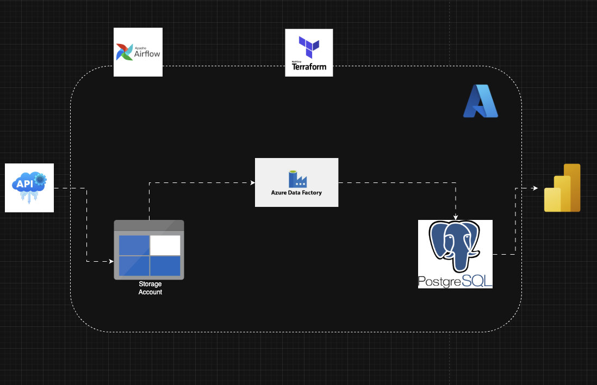

# Urban City 311 Service Reporting Data Engineering Project

A data engineering project focused on public-sector service operations and smart-city reporting. This solution processes 311 service request data for urban reporting, helping city teams monitor issues, trends, and response performance across neighborhoods.

## Project Overview
This project demonstrates how raw public service requests can be ingested, transformed, and prepared for analytics in a cloud-based data pipeline. The use case sits in the municipal/public services industry, where agencies need reliable visibility into issues such as street maintenance, sanitation, infrastructure, and neighborhood complaints.

### Data Pipeline Architecture

## Industry Focus
- Public sector / municipal services
- Smart city operations
- Civic service reporting and analytics
- Urban infrastructure monitoring

## Data
The pipeline works with 311 service request records, including:
- request created and closed dates
- issue type and problem detail
- location type and address
- city and borough
- latitude and longitude

This data supports service demand analysis, operational reporting, and location-based trend monitoring.

## Architecture
The project follows a simple lakehouse-style workflow:
- Bronze: raw source data stored in Azure Blob Storage
- Silver: cleaned and standardized parquet data
- Gold: structured table for reporting and downstream analytics

## Tools and Technologies
- Python
- Apache Airflow for orchestration
- Azure Blob Storage for raw and processed data
- Azure Data Factory for pipeline movement
- PostgreSQL for the gold layer
- Terraform for cloud resource provisioning
- Polars for data transformation

## Workflow
1. Extract 311 service request data
2. Upload raw data to Azure Blob Storage
3. Transform and standardize the dataset
4. Load refined data into a reporting-ready structure
5. Orchestrate the workflow with Airflow and Azure Data Factory

## What This Project Shows
- End-to-end data pipeline design
- Cloud data engineering in Azure
- ETL/ELT workflow orchestration
- Data cleaning and schema standardization
- Public-sector analytics use cases
- Infrastructure as code with Terraform

## Repository Purpose
This repository is designed to highlight practical data engineering capabilities in the public sector and civic analytics space, with a strong emphasis on real-world operational data pipelines and cloud architecture.
